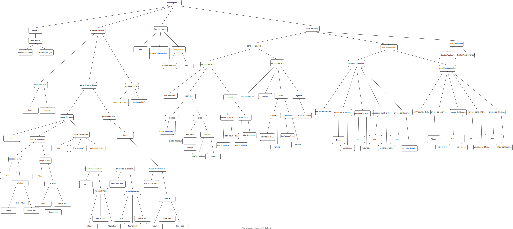
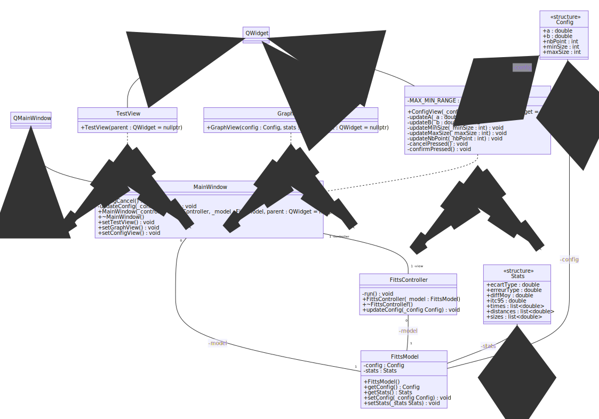
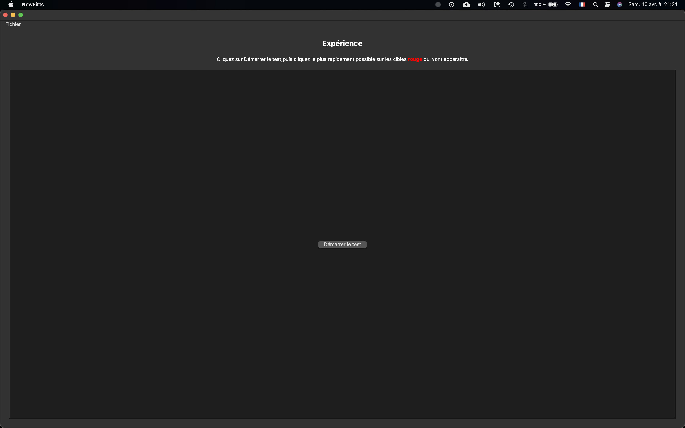
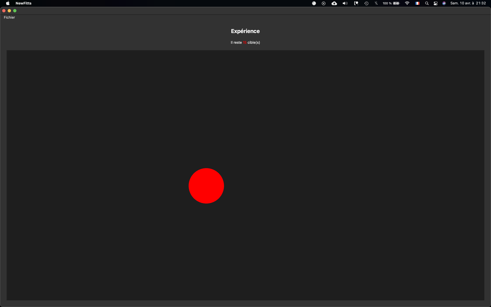
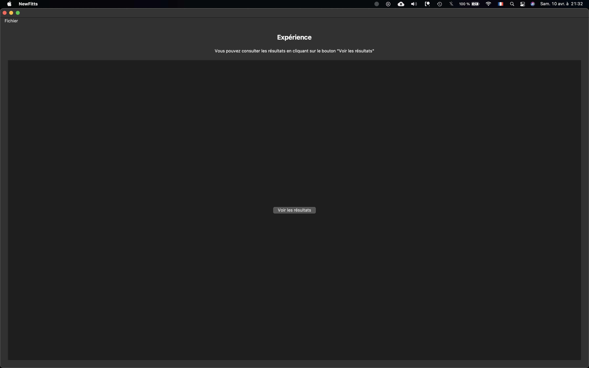
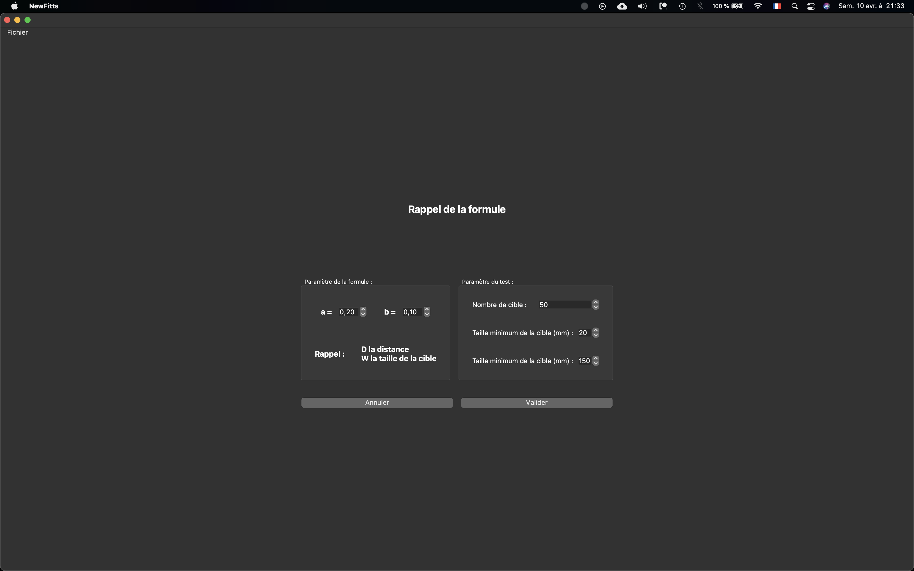
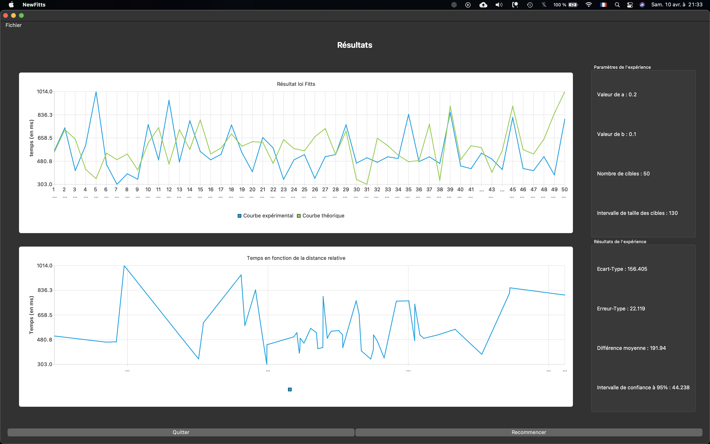

# Rapport de TP - Loi de Fitts

Les diagrammes au format SVG inclus dans ce rapport ont été réalisés avec l'éditeur `Mermaid`, et le rapport lui-même a été écrit et généré en markdown grâce à l'éditeur `MarkText`. 

****L'archive du TP contient**** :

    - Un répertoire `doc` contenant les diagrammes, captures d'écan de l'application et le rapport

    - Un répertoire `srcs` contenant un sous-répertoire `OldFitts` qui correspond à la version originale de l'application, retravaillée par nos soins pour mieux coller à l'architecture MVC, ainsi qu'un répertoire `NewFitts` correspondant à notre application construite à partir de zéro

**Instructions pour lancer notre interface** :

    - Build le NewFitts.pro 

    - Copier le fichier `fittsFormula.svg` depuis `/srcs/NewFitts/Assets` et le coller dans le répertoire de build de l'application

## 1. Donner une critique de l'interface fournie et du programme QT associé

- La formule mathématique n'apparait pas à l'écran

- Le titre des groupe box n'est pas assez visible

- Le Modèle construit la Vue qui construit le Contrôleur, ce qui est contraire à la philosophie de l'architecture MVC

- Toutes les Vues sont regroupées dans une seule classe au lieu d'être séparées en plusieurs fichiers / classes

- Les classes sont toutes `friend` entre elles, or elles ne dovient pas et devraient utiliser des `getteurs` et `setteurs` , ou des signaux, pour discuter entre-elles

## 2. Rendre plus conforme le programme au modèle MVC en C++

**Changements éffectués :** 

- Le Contrôleur est instancié en premier avec un Modèle, puis seulement après le Contrôleur instancie une Vue

- Les classes ne sont plus `friend` entre elles

- Les classes utilisent désormais des accesseurs pour récupérer les données, et des mutateurs pour modifier les données

## 3. Repenser l'interface

Interface refondue entièrement de zéro, avec ré-écriture de l'entièreté du code source de l'application pour répondre à une exigence de propreté du programme, qui aurait était impossible à réaliser avec le code original au vu de sa très mauvaise organisation et de son manque de documentation. 

Il s'agissait de faire une interface visuellement épurée et facilement utilisable, tout en répondant aux besoins des utilisateurs pour paramétrer les données et réaliser l'expérience.

### Model

- Sauvegarde des paramètres de l'expérience sur le disque pour éviter d'avoir à les re-sélectionner à chaque lancement de l'application
- Il stocke toutes les données des variables

### Contrôleur

- Il effectue tous les calculs qui lui sont demandés par les vues, en utilisant si nécessaire les données contenues dans le modèle

### Vues

- La vue `testView` correspond à la fenêtre de lancement de l'expérience. Elle possède un bouton pour lancer le test, puis une fois terminé un autre pour accéder aux résultats
- La vue `configView` permet le réglage des paramètres de l'expérience. Elle renvoie vers `testView`  une fois les changements effectués. Elle est accessible depuis la barre des menus, onglet `Options` , depuis n'importe quelle vue
- La vue `graphView` sert à l'affichage des informations statistiques ainsi qu'aux deux graphiques de résultats de l'expérience
- La vue `detectClick` contient une classe héritant d'un objet QGraphics pour détecter la position des clics de la souris sur la scène de l'expérience
- La vue `mainWindow` permet l'échange de données et d'informations entre les autres vues, le modèle et le contrôleur

## 4. Fournir les résultats statistiques

Les deux graphes ainsi que les statistiques sont affichés à la fin de l'expérience, dans la vue `testView` .

## 5. Diagrammes, Dictionnaire de données et Évaluation

- Dictionnaire de données (disponible dans le dossier en format pdf)
  
  

   

- Diagramme de structure (disponible en format svg, ouvrable avec Firefox)
  
  

- Diagramme d'état / transition (disponible en format svg, ouvrable avec Firefox)

- Diagramme de classe (disponible en format svg, ouvrable avec Firefox)
  
  

- Évaluation de la nouvelle interface
  
  La nouvelle interface est très épurée et fonctionnelle. Du point de vue du code source, l'organisation du programme respecte la philosophie de l'architecture MVC, et dispose d'une documentation sous forme de commentaires pour préciser à quoi correspondent chaque bloc de code.

## Captures d'écran de l'application sous macOs

